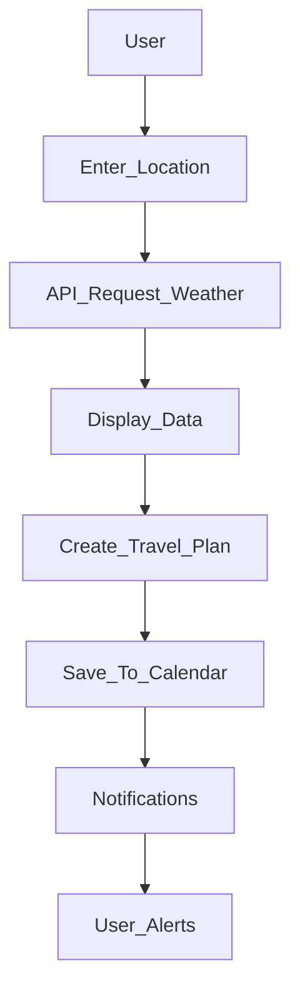

# 🌦️ ClimaVibe

Your Personal Weather-Based Travel Planner

---

## 📋 Description

WeatherWise is a smart application designed to combine weather forecasting with travel planning. It offers users accurate weather reports and helps them build their travel schedules based on current and predicted weather conditions. Explore hassle-free trip planning and never let bad weather ruin your adventures again!

---

## 🚀 Features

- **Weather Forecasting**: Hourly, daily, and weekly forecasts powered by reliable APIs (OpenWeatherMap, WeatherAPI, etc.).
- **Travel Planner**: Create personalized itineraries based on the weather.
- **Activity Suggestions**: Tailored recommendations based on weather (e.g., sunny = hiking or beach day; rainy = museums or cafes).
- **Map Integration**: Visualize destinations and routes using Google Maps API or Mapbox.
- **Notification System**: Alerts about sudden weather changes or ideal days for planned trips.
- **Interactive Calendar**: Schedule your trips within the app.
- **Offline Mode**: Save trip details and weather for offline use.

---

## 🛠️ Technology Stack

### Frontend

- Framework: **React Native** or **Flutter**
- Styling: **CSS-in-JS** (if React Native) or **Widget-based Design** (if Flutter)

### Backend

- Language: **Node.js** (JavaScript) or **Python** (Django/Flask)
- Database: **Firebase Firestore**, **PostgreSQL**, or **MySQL** (for storing user settings, trip details, and recommendations)

### Third-Party APIs

- **Weather Data**: OpenWeatherMap API / WeatherAPI / AccuWeather API
- **Maps & Routes**: Google Maps API or Mapbox
- **Notifications**: Firebase Cloud Messaging / OneSignal

### Tools

- **Version Control**: GitHub / GitLab
- **Containerization**: Docker for scalable development
- **CI/CD**: CircleCI / GitHub Actions for faster deployments

---

## ⚙️ Installation Guidelines

### For Development

1. Clone the repository:

```bash
git clone https://github.com/YourUsername/WeatherWise.git
cd WeatherWise
```

2. Install dependencies:

```bash
npm install            # For React Native
flutter pub get        # For Flutter
```

3. Set environment variables:  
Create a `.env` file and include your API keys for weather and maps. Example:

```env
WEATHER_API_KEY=your_api_key_here
MAPS_API_KEY=your_api_key_here
```

4. Start the application:

```bash
npm run start          # For React Native Development
flutter run            # For Flutter Development
```

5. Backend setup:  
Follow instructions in the `backend/README.md` file to set up the backend.

---

## 💡 Usage Guidelines

1. Open the app and allow location access for automatic weather forecasts.
2. Browse weather forecasts and plan your trip around ideal conditions.
3. Use the calendar feature to save your plans and check updates.
4. Activate notifications to stay informed about sudden weather changes or updates to your saved plans.

---

## 🎨 Workflow Diagram

Here’s a simplified app flow:



---

## 📈 Market Strategy

### Target Audience

- Solo travelers, families, and adventure enthusiasts
- Domestic and international tourists looking for weather-dependent trip planning

### Approach

- Collaborate with travel agencies for integrated recommendations
- Promote on social platforms with interactive weather-based travel tips
- Launch with a freemium model:
  - Free weather and basic planning
  - Premium features like tailored suggestions, offline support, and ad-free

---

## 🙌 Contributing

We are open to feature suggestions and contributions from all developers and users. Feel free to:

- Open an issue on GitHub for bugs/feature requests
- Submit pull requests for code contributions

---

## ©️ License

This project is licensed under the [MIT License](LICENSE).

---

## 📞 Contact Information

- **Email**: your_email@example.com
- **GitHub**: [YourUsername](https://github.com/YourUsername)
- **Website**: [YourWebsite](#)
